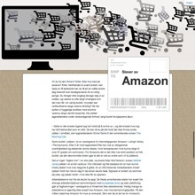
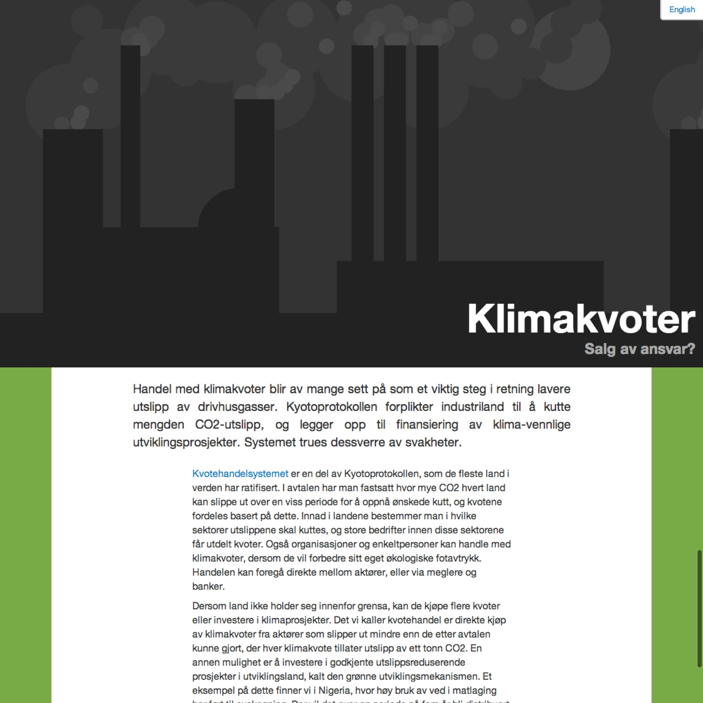
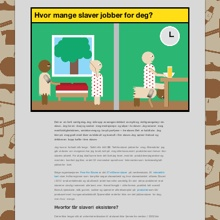
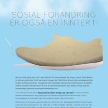
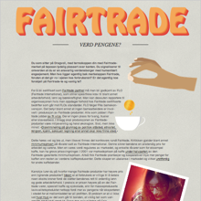




<nav>
  <ul>
    <li>
      <a href="2013/slaver-av-amazon/">
        <article>
          
          
Erland Årstøl

          <h1>Slaves of Amazon</h1>
        </article>
      </a>
    </li>
    <li>
      <a href="2013/carbon-emission-schemes/">
        <article>
          
          
Eline Hansen Næset

          <h1>Carbon emission schemes – Trading away responsibility?</h1>
        </article>
      </a>
    </li>
    <li>
      <a href="2012/how-many-slaves-are-working-for-you/">
        <article>
          
          
Kaja Juul Skarbø

          <h1>How many slaves are working for you?</h1>
        </article>
      </a>
    </li>
    <li>
      <a href="2012/social-development-is-also-currency/">
        <article>
          
          
Jonathan Torstensen

          <h1>Social development is also currency!</h1>
        </article>
      </a>
    </li>
    <li>
      <a href="2012/fairtrade-worth-what-you-pay/">
        <article>
          
          
Alexandra Lyngstad

          <h1>Fairtrade – Worth what you pay?</h1>
        </article>
      </a>
    </li>
    <li>
      <a href="2012/the-european-dream/">
        <article>
          
          
Daniel Stølsbotn

          <h1>The European dream</h1>
        </article>
      </a>
    </li>
    <li>
      <a href="2012/norway-a-nation-of-peace-and-of-weapons-export/">
        <article>
          
          
Jonathan Torstensen

          <h1>Norway</h1>
          <h2>A nation of peace and of weapons export</h2>
        </article>
      </a>
    </li>
    <li>
      <a href="2012/what-is-global-trade/">
        <article>
          
          
Elise Tengs

          <h1>What is global trade?</h1>
        </article>
      </a>
    </li>
  </ul>
</nav>

<!-- I am lazy -->
